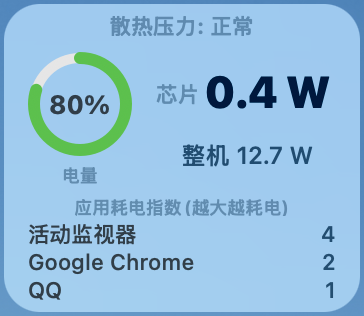

# PowerWidget

Mac 桌面浮动小组件:**实时芯片功耗 · 电池流向 · 机身热度 · 最耗电的 3 个应用**。

A floating macOS desktop widget showing real-time SoC power, battery flow, thermal pressure, and the top 3 energy-hungry apps.

---

## 功能 | Features

- **大字**:CPU+GPU 实时功耗(瓦特,1Hz 刷新)
- **圆环**:电池电量(跟 macOS 状态栏一致)
- **小字**:电池流向 / 整机功耗 / 充电速率 / 满电状态
- **顶部**:macOS 热压力等级(正常 / 微热 / 偏热 / 较热 / 严重发热)
- **底部**:当前最耗电的 3 个 GUI 应用(系统进程和守护进程自动过滤)
- 可拖动到任意位置,**位置自动记住**
- **单实例锁**:防止双击多次启动
- **浅深色模式自适应**
- **首次安装一次密码**,后台 LaunchDaemon 开机自启,以后再开 .app 不问密码
- 日志超过 200 MB 自动清空

---

## 安装 | Install

1. 从 [Releases](../../releases) 下载 `PowerWidget.zip`
2. 解压
3. **右键 `install.command` → 选「打开」**(macOS 会弹一次"无法验证开发者",点「打开」即可)
4. 弹出系统密码框 → 输入你的 Mac 密码(只这一次)
5. 桌面右上角出现小组件

详细步骤见解压后的 `使用说明.txt`。

---

## 卸载 | Uninstall

双击 `uninstall.command`,输 Mac 密码,完成。然后把 `PowerWidget.app` 拖到废纸篓即可。

---

## 系统要求 | Requirements

- **Apple Silicon Mac**(M1 / M2 / M3 / M4)
- **macOS 11**(Big Sur)或更新版本
- 不支持 Intel Mac

---

## 工作原理 | How it works

- 安装时部署一个 LaunchDaemon,以 root 运行 `powermetrics --samplers cpu_power` 输出到 `/tmp/pm_widget.log`
- 第二个 LaunchDaemon 每 30 分钟检查日志,超过 200 MB 自动 truncate
- Widget(Python + PyObjC,打包成 `.app`)读取 log + `ioreg` + `NSWorkspace.runningApplications` 渲染 UI
- Top 应用过滤逻辑:只显示 `activationPolicy == NSApplicationActivationPolicyRegular` 的进程(Dock 里有图标的)
- 同一 app 的多个子进程(Helper、Renderer)按 executableName 聚合求和

---

## License

MIT
